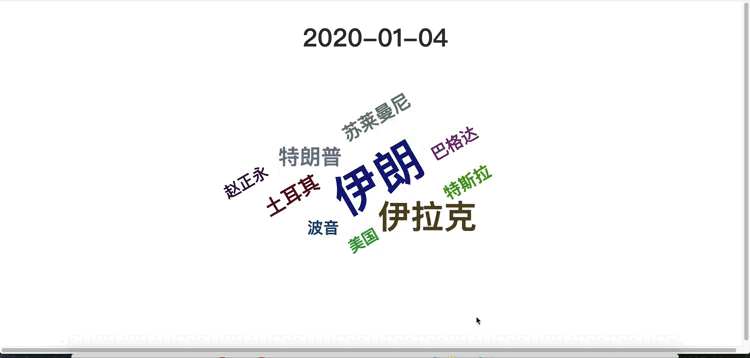
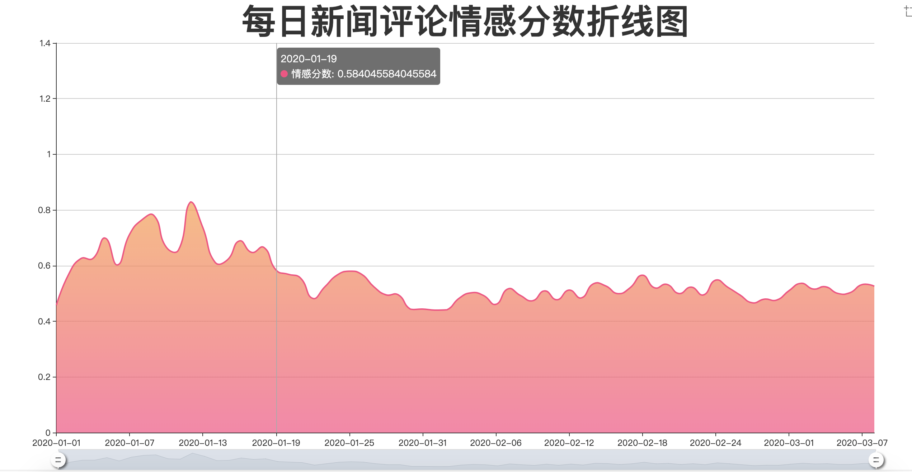
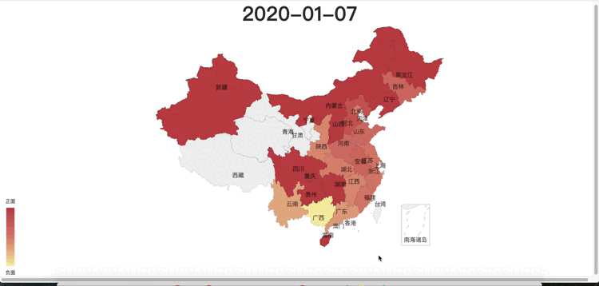

# 面向新冠肺炎的社会计算应用
## 1.项目简介
新冠肺炎疫情牵动着我们每一个人的心，在本项目中，我们将尝试用社会计算的方法对疫情相关的新闻进行分析，助力疫情信息研究，并由此分析社会趋势。

## 2.数据说明
https://covid19.thunlp.org/ 提供了与新冠疫情相关的社交数据信息，分别为疫情相关谣言 CSDC-Rumor、疫情相关中文新闻 CSDC-News和疫情相关法律文书 CSDC-Legal。本项目使用疫情相关中文新闻CSDC-News数据。

下载链接：https://data.thunlp.org/covid19/news.zip

数据集中包含2020-01-01至2020-08-31期间共计502550条新闻文本数据，以及2020-01-01至2020-03-08期间收集的1534616条新闻评论数据。

## 3. 针对新闻文本的关键词分析
### 3.1 相关代码
详见`新闻文本数据处理.ipynb`
### 3.2 实现思路
- 由于新闻文本中存在130451条新闻文本是没有关键词的，因此我们使用了jiagu自然语言处理工具的keywords接口进行关键词的抽取。
- 由于抽取出的关键词存在一定的误差，因此还进行了相应的人工筛查。
- 最终使用所有新闻关键词进行加权计算，得到每日权重最高的前10个关键词。
- 并结合echarts与echarts-wordcloud等js包，实现了新闻文本关键词词云图。
- 词云图见`report/echarts图表/新闻文本关键词词云.html`。
- 以下为部分词云图的动图gif：

### 3.3 结论
- 可以看到在2020-01-19之前，新闻关键词基本以伊朗、特朗普为主，说明当时的新闻以国际形势为主
- 但是从2020-01-19开始，关于疫情、湖北、新冠的关键词开始慢慢增多，并开始占据较大范围
- 通过新闻关键词，深刻反映了那段时期，中国新闻报道的主流趋势

## 4. 针对新闻评论的情感分析
### 4.1 相关代码
详见`新闻评论数据处理.ipynb`
### 4.2 实现思路
- 由于获取新闻评论数据并没有进行情感上的分类，因此我们使用了与新闻评论数据类似的weibo_senti_100k数据集进行情感分类模型训练。
- 基于预训练语言模型chinese-roberta-wwm-ext模型，对weibo_senti_100k数据集进行训练后，在预先切分的验证集上获得了0.97的f1值；具体训练代码见`sentiment_classification`目录。
- 最终使用训练好的模型，在新闻评论数据上进行情感分类(正面或者负面)，并以此计算每日、各地区的情感倾向分数。
- 基于echarts，实现了每日新闻评论情感分数折线图、新闻评估情感分析_日期地域分布图。
- 相关图表见`report/echarts图表/每日新闻评论情感分数折线图.html`及`report/echarts图表/新闻评论情感分析_日期地域分布.html`
- 以下为每日新闻评论情感分数折线图

- 以下为部分新闻评估情感分析_日期地域分布图的动图gif：

### 4.3 结论
- 可以看到在2020-01-19以前，新闻评论对于疫情的情感分数基本在0.6以上
- 但是在2020-01-19之后情感分数基本都低于0.6，在0.5左右徘徊
- 在2020-01-30至2020-02-02期间，情感分数甚至跌到了0.44左右
- 这揭示了群众对于疫情的情感走向，在2020-01-19之前还是以乐观为主，
- 但是在2020-01-19之后，随着更多的关于疫情的新闻流出，人民群众对于疫情的乐观程度开始下降，悲观情绪开始抬头，
- 尤其是在武汉封城后出现的各种情况、李文亮医生事件爆发期间，情感分数明显降低，出现了明显的一个低谷
- 但是随着疫情蔓延势头得到控制，人民群众对于疫情的情感分数也开始逐步提升，慢慢爬升到0.5左右
- 通过评论的情感分析，深刻反映了那段时期，中国网民对于疫情的心理变化

## 5.总结与不足
- 我们所制作的图表所揭示的关键词走势、情绪走势，与当时疫情发生的走势基本一致，说明我们得到的数据及结论基本符合真实的疫情发展走势。可以看到，互联网的普及让更多人的情感与想法得以在数字空间得到快速表达与传播，情绪的传染面比以往更大。在2020年1月初期只有零星几个省份的网友进行疫情的讨论，但是很快就通过互联网的传播，让大部分省份的网友都参与进去进行讨论。这揭示了现今阶段，人民群众关于各类事件的参与度更加密切，对于各类事件的情绪传播也更加快速，因此如何将舆情导向到良好的方向，是后续政府工作的重点。
- 在关键词提取阶段，我们使用jiagu的keywords接口进行提取，存在一定的局限性，后续可以考虑使用相关文本摘要的模型进行关键信息的提取。
- 在情感分析阶段，我们使用了类似的数据集weibo_senti_100k，并基于预训练语言模型chinese-roberta-wwm-ext进行情感分类模型的训练，但是新闻评论数据与微博评论还是存在一定的差距，后续可以考虑重新标记后进行训练。另外，训练出的bert模型进行预测相对较慢，后续可以在精度允许的范围内，进行模型蒸馏，加速模型的预测。